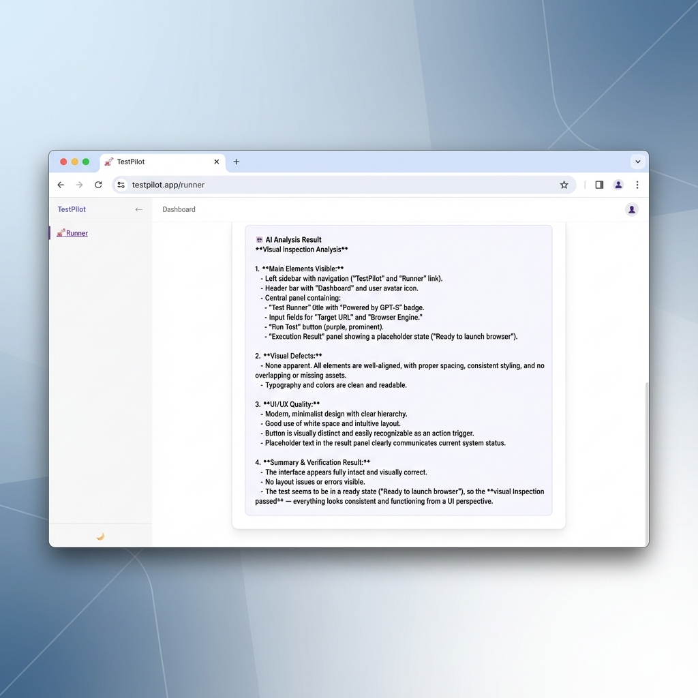

# 🚀 TestPilot

**TestPilot** is an AI-powered Web Integration Testing tool that combines the reliability of **Playwright** with the cognitive capabilities of **GPT-5 Vision**.

It allows developers to run automated browser tests and receive intelligent, visual-based analysis of the UI, going beyond simple assertion checks.



## ✨ Features

- **Web Testing Engine**: Built on Playwright for .NET, supporting Chromium, Firefox, and WebKit.
- **AI Vision Analysis**: Integrates **GPT-5** to visually inspect screenshots for layout issues, defects, and UX quality.
- **Modern UI**: Featuring a responsive dark-themed interface and real-time feedback.
- **Smart Reconnection**: Robust session management with auto-recovery UI.

## 🛠️ Tech Stack

- **Framework**: .NET 10 (Blazor Server)
- **Automation**: Microsoft.Playwright
- **AI**: Azure OpenAI (GPT-5 / GPT-4o)
- **Styling**: Vanilla CSS (Modern Design System)

## 🚀 Quick Start

### Prerequisites
- .NET 10.0 SDK
- Azure OpenAI API Access

### Installation

1. **Clone the repository**
   ```bash
   git clone https://github.com/breezy89757/TestPilot.git
   cd TestPilot
   ```

2. **Configure Secrets**
   Copy the template and add your API keys:
   ```bash
   cp appsettings.template.json appsettings.json
   ```
   Edit `appsettings.json`:
   ```json
   "AzureOpenAI": {
     "Endpoint": "https://your-resource.openai.azure.com/",
     "ApiKey": "sk-...",
     "DeploymentName": "gpt-5"
   }
   ```

3. **Install Browsers** (First time only)
   ```bash
   pwsh bin/Debug/net10.0/playwright.ps1 install
   ```

4. **Run**
   ```bash
   dotnet run
   ```
   Visit `http://localhost:5272`

## 📝 License

MIT
